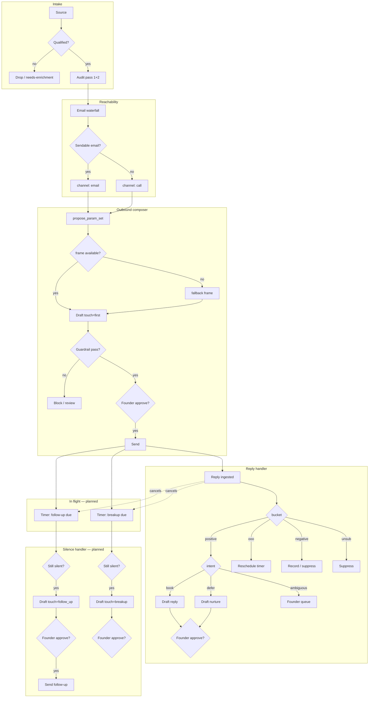

# Conditional Logic Graph — B2B Outbound Lead Pipeline
# Owned by: /platform-engineer · Canonical reference for how rules fire across the worked-lead engine
# Status: design reference (2026-06-25). Maps built vs planned behavior to scenario-specific examples.
# Related: `gtm.md` (pain-matched entry, channel sequence §3), `draft-outreach.py` (propose_param_set), `pipeline-checkpoint.py` (reply handler), `cold-call-queue.md` (call queue)
# Visual: `pipeline-flow.html` (business-facing diagram — plain language, live vs soon)

## One line

For a metal fab shop where we found **[specific leak]**, we propose **[specific outreach package]**; if they **[specific response]**, we draft **[specific next move]**; if they go quiet for **[specific interval]**, we escalate **[specific touch on specific channel]** — founder approves every send.

This is a **decision graph over a state machine**, not a left-to-right script chain.

---

## Shape: zones, not one wire mesh

```
┌─────────────┐     ┌──────────────┐     ┌─────────────┐     ┌──────────────┐
│   INTAKE    │ ──► │   ENRICH     │ ──► │  OUTBOUND   │ ──► │   IN FLIGHT  │
│  (who gets  │     │  (can we     │     │  (what to   │     │  (sent,      │
│   in)       │     │   reach them)│     │   say)      │     │   waiting)   │
└─────────────┘     └──────────────┘     └─────────────┘     └──────┬───────┘
                                                                      │
                    ┌─────────────────────────────────────────────────┘
                    │
         ┌──────────┴──────────┐
         ▼                       ▼
┌─────────────────┐    ┌─────────────────┐
│  REPLY EVENTS   │    │  TIME EVENTS    │
│  (they wrote)   │    │  (silence/OOO)  │
└────────┬────────┘    └────────┬────────┘
         │                      │
         └──────────┬───────────┘
                    ▼
            ┌───────────────┐
            │ FOUNDER GATE  │
            └───────┬───────┘
                    ▼
            ┌───────────────┐
            │  NEXT ACTION  │
            └───────────────┘
```

Three trigger families stay visually and logically separate:

1. **What we learned about them** — audit / enrichment
2. **What they did** — reply, bounce, book, unsubscribe
3. **What time did** — no reply, OOO window expired, follow-up due

Each layer reads the same lead record and writes back stage + artifacts + scheduled jobs.

---

## Built vs planned (honest map)

| Layer | Status | Where |
|---|---|---|
| Intake gate + angle router | Built | `lead-gate.py`, `lead-angle-router.py` |
| Audit pass 1+2 → signals | Built | `lead-audit.py`, `lead-audit-pass2.py` |
| Email waterfall → channel | Built | `lead-enrich-email.py`, `propose_param_set` channel gate |
| Signal-based call-first (`call_only_seeds`, L0) | Planned | seeds stored on audit; `propose_param_set` ignores them today |
| SMS emitter | Built | `draft-outreach.py` `_build_sms` |
| SMS auto-routing | Planned | never set by `propose_param_set`; breakup touch only (design) |
| Multi-touch orchestration (email → call → SMS) | Planned | GTM §3; cadence in this doc; no `sent_at` / channel state |
| Cold call queue (parallel path) | Built (separate) | `cold-call-queue` → `cold_calls`; not synced with email send state |
| Frame / angle / offer composer | Built | `draft-outreach.py` `propose_param_set`, `_resolve_recommended_frame` |
| Anti-fab guardrail | Built | `outreach_guardrail.py` |
| Founder gate before send | Built (process) | GTM + `human_tasks`; stage `edited` before `sent` |
| Reply bucket classify | Built | `pipeline-checkpoint.py` — positive / negative / ooo / unsubscribe |
| Reply intent branching | Planned | positive → one template today; intent map not wired |
| Silence / cadence timers | Planned | `touch` first/follow_up/breakup exists; no `sent_at` + timer events |
| `pain_tag` + temperature from scrape | Planned | GTM backbone; field exists on store, not fully derived pre-touch |
| Instantly ingest | Stub | `lead-ingest.py` Instantly adapter |

---

## Scenario walkthrough: Peachtree Precision Machining

Composite lead from the 812-lead manufacturing batch.

**Audit finds:**

- `wedge` = L2 (has a site)
- `lead_with` = `adjectives_not_numbers`
- `evidence_token` = literal phrase from capabilities page (e.g. *"world-class precision"*)
- benchmark line exists in `signal_rationale` for that signal
- email on contact page (waterfall step 2), SMTP verified
- `pain_tag` = not margin_blind yet (cold)
- no `demo_url` built yet

### Cold outbound (built today)

```
[Peachtree — stage: audited]

        ┌─ email waterfall ─────────────────────────────┐
        │ mailto ✗ → contact page ✓ → verified         │
        └───────────────────────────────────────────────┘
                              │
                    sendable email? YES
                              │
              ┌───────────────▼───────────────┐
              │  propose_param_set          │
              │  angle: adjectives_not_numbers│
              │  frame: challenger-evidence │  ← evidence + benchmark both present
              │  channel: email             │
              │  offer: L2                  │
              │  touch: first               │
              │  ask: reply                 │
              └───────────────┬───────────────┘
                              │
              ┌───────────────▼───────────────┐
              │  guardrail                    │
              │  evidence_token ∈ audit?      │
              └───────┬───────────────┬───────┘
                   YES              NO → BLOCK draft
                    ▼
              [FOUNDER GATE — approve cold_email]
                    ▼
              [Send — stage: sent]
```

### Contrast: no-site shop in same batch

- `wedge` = `L0_candidate`
- waterfall finds nothing sendable → `channel = call`, `frame = peer-operator` (challenger never proposed for no-site)
- opener is soft "noticed you don't have a site" — not capability roast
- on call, if **"we're fine on referrals"** → GTM pivot to margin question (L3), not argue website (`gtm.md` §1)
- if clean margin visibility → genuine no-fit, mark and move on

---

## Audit signal → outreach package (root conditional)

| Audit result | Graph decision | First touch shape |
|---|---|---|
| `adjectives_not_numbers` + benchmark | challenger-evidence-led, L2, email | quote fluff phrase + engineer self-qualify frame |
| `adjectives_not_numbers`, no benchmark | challenger blocked → peer-operator or humble-student | observation without published stat |
| `review_lead_response` + Yelp *"no response after two weeks"* | angle = review leak; offer = L2 front-office | "saw a review saying quotes go unanswered…" |
| `no_site` / `L0_candidate` | channel = call; frame = peer-operator; offer = L0 candidate | soft site offer; pivot path to margin if "doing fine" |
| `rfq_no_cad_upload` | angle = RFQ friction; offer = L2 | engineers can't self-qualify without CAD upload |
| email waterfall fails | channel = call; skip email draft | call script from same `lead_with` |
| `demo_url` present | demo-gift frame (any non-no-site wedge) | gift the built demo |

Frame priority in code (`_resolve_recommended_frame`):

1. `demo-gift` if `demo_url`
2. `challenger-evidence-led` if L2 + evidence + benchmark (never for no-site wedges)
3. `peer-operator` for no-site or L2 without challenger
4. `humble-student` fallback

---

## Multichannel routing (email · call · SMS)

GTM motion (`gtm.md` §3): **remote cold, multi-touch — call + email + SMS**, all founder-gated. Channels are capabilities; orchestration across them is mostly planned.

### What triggers each channel today (code)

| Channel | Automatic trigger in `propose_param_set` | Emitter / consumer |
|---|---|---|
| **email** | `check_email_sendable` → verified or risky address | `draft-outreach.py` cold_email artifact → Instantly |
| **call** | No sendable email after waterfall | `draft-outreach.py` call **deferral** → call-script SOP; full script from `cro-cold-calls` |
| **sms** | None — manual `--channel sms` only | `draft-outreach.py` `_build_sms` (≤160 chars) |

**Only rule wired:** email if sendable, else call. SMS is never auto-proposed.

**Parallel path:** `cold-call-queue` loads qualified leads with `dial_number` + L2-records into `cold_calls` (ADR-075). This queue does not read email send state or `propose_param_set` output — it runs alongside email outbound, not as a downstream branch.

### `call_only_seeds` — designed for calls, not wired to channel

Audit output includes `call_only_seeds[]` (`lead-audit.py` → stored on lead). Conversation starters for discovery; **stored, not used to pick `channel`**.

| Seed / signal | Design intent (`audit-engine-design.md`) | Headlines email? | Wired to `channel=call`? |
|---|---|---|---|
| `paid_pixel` | "Already buying ads — where does traffic land?" | No (`not_a_leak`; demoted from headline) | No |
| `analytics_suspected_absent` | L2 email frame; L3 margin seed **on call only** | No (weak; never headlines) | No |
| Job posts (CSR/dispatcher hiring) | "Phones are buried" — call opener | Pass-2 signal | No |
| `margin_blind` | Call-only — invisible to site crawl | Never in cold email | GTM only |
| `no_site` / `L0_candidate` | Call-heavy; soft site opener; referral pivot → L3 | peer-operator frame yes | Only if no email |

**Gap example:** shop with verified email **and** confirmed `paid_pixel` → code sends **email** with a different `lead_with` signal; paid pixel sits in `call_only_seeds` for manual use on a call.

### Primary channel selection (target logic)

Primary = first touch. Secondary = same lead, same `evidence_token`, different channel + timing.

```
[Audit + enrich complete]

Has verified/risky email?
  NO  → PRIMARY = call
        (always: no_site, L0, phone-only shops)

  YES → Call-priority check (planned — not in propose_param_set yet):
        wedge ∈ {L0_candidate, no_site, parked_site}?
          → PRIMARY = call (email optional secondary)
        call_only_seeds non-empty AND seed ∈ {paid_pixel, job_post_csr}? 
          → PRIMARY = call
        else
          → PRIMARY = email
```

### Secondary channels (orchestration — planned)

| Condition | Add channel | Touch | Why |
|---|---|---|---|
| Email sent, no reply 3bd, no call logged | call | first or follow_up | GTM multi-touch; live pain diagnosis |
| `call_only_seeds` present | call uses seed as opener | first | paid_pixel, hiring, analytics L3 seed |
| Email follow_up sent, still silent ~4bd | sms | breakup | short last touch; hook + ask only |
| L0 + phone on GMB | call first even if email found | first | GTM: no-web is call signal for "want more work?" |
| Warm flip (margin pain on call/reply) | loom + call | — | skip cold email sequence (`gtm.md` §2) |

### SMS — when to use and when not to

**Use (planned):**

- `touch=breakup` after email follow_up silence
- L0 nudge when call went to voicemail (optional)
- Short ask only; same `evidence_token` abbreviated

**Do not use:**

- First touch on strong L2 email lead (challenger frame does not fit 160 chars safely)
- Any touch where guardrail cannot fit claims ⊆ audit tokens
- `suppressed` or hard-negative leads

### Multichannel examples (812-lead batch)

**Peachtree Precision — L2, verified email, `adjectives_not_numbers`, no call seeds**

| Day | Channel | Touch | Status |
|---|---|---|---|
| 0 | email | first (challenger) | Built |
| 3 | email | follow_up | Planned |
| 3 | call | first (if not dialed) | Planned |
| 7 | sms | breakup | Planned |

**Sample no-site shop — no website, phone on GMB, no email**

| Day | Channel | Touch | Status |
|---|---|---|---|
| 0 | call | first (peer-operator) | Built via channel=call |
| — | email | — | Skipped |

**Shop running Facebook ads — `paid_pixel` + verified email**

| Day | Channel | Touch | Status |
|---|---|---|---|
| Design | call | first ("where does traffic land?") | Not wired |
| Code today | email | first (different `lead_with` headline) | Built; pixel in `call_only_seeds` only |

### Call artifact shape (built)

`channel=call` does not invent talk-track copy. `_build_call_deferral()` stamps:

- `lead_with`, `frame`, `ask`, `touch`, opening line from audit
- pointer to call-script-write SOP

Full script: `cro-cold-calls` pipeline (warm-hooks waterfall, `cold_calls` queue).

### Multichannel fields (planned)

| Field | Purpose |
|---|---|
| `primary_channel` | email / call / sms — first touch choice |
| `channels_attempted` | e.g. `["email","call"]` — prevents duplicate same-day spam |
| `last_call_at` | gates "call if not dialed" on silence path |
| `call_only_seeds` | already on audit; should feed call-priority router |

### Wiring note (when implementing)

Extend `propose_param_set(lead, *, touch="first", purpose="primary"|"secondary")` to:

1. Read `audit.call_only_seeds` and wedge for call-first override before defaulting to email.
2. Accept explicit `channel` + `touch` from silence/reply routers (follow_up email, breakup sms).
3. Sync `cold_calls` queue with `channels_attempted` so parallel pipelines do not double-hit.

---

## Reply branches (partially built)

Peachtree replies to cold email. Three threads on the same graph:

### A — wants a call (mostly built)

```
Reply: "Yeah send me some times, we're looking at this"

  → bucket: positive
  → intent: schedule (planned: explicit intent map; today: all positives → same template)
  → temperature: warm
  → draft: booking reply (15-min demo, their job types)
  → artifact: reply
  → [FOUNDER GATE] → send → stage: replied → confirm → booked
```

Today: `pipeline-checkpoint.py` `draft_next_touch()` — one generic booking template for all positives.

### B — not now, not dead (planned)

```
Reply: "Interesting but slammed until Q3"

  → bucket: positive (or soft-positive)
  → intent: defer
  → draft: "no rush — ping you in August?"
  → set timer: retry_at = Q3 − 2 weeks
  → cancel breakup timer
  → [FOUNDER GATE] → send → stage: replied, nurture
```

### C — wrong fit (partially built)

```
Reply: "We use JobBOSS, we're not changing anything"

  → bucket: negative
  → intent: have_stack / not_interested
  → suppress OR tag competitor_erp=jobboss
  → no follow-up sequence
```

Today: negative recorded, no advance. Intent tagging not wired.

### OOO (partially built)

```
  → bucket: ooo
  → record reply_class, no advance
  → planned: parse return date → schedule retry_at return+1d; else T+14d
```

---

## Silence / multi-touch cadence (planned)

GTM motion: remote cold, multi-touch — call + email + SMS, all founder-gated (`gtm.md` §3).

```
Day 0   sent email (challenger, adjectives_not_numbers)
        └─ arm timer: +3 business days

Day 3   still sent, no reply, no call logged
        └─ propose touch=follow_up, channel: email
        └─ [FOUNDER GATE] → send

Day 3   parallel (same evidence, different channel)
        └─ if no call attempt → call_prep artifact
           references same evidence_token

Day 7   still silent after follow_up
        └─ propose touch=breakup, channel: sms (≤160 chars)
        └─ [FOUNDER GATE] → send

Day 14  still silent
        └─ close → lost (or 90-day long_pool)
```

Rules:

- Timers cancel on any reply event.
- Follow-up / breakup re-run guardrail; stale audit → re-audit or fallback frame, not recycled challenger.
- Cadence may differ per wedge or channel (call-first leads may skip email follow-ups).

In-flight fields the time layer needs:

| Field | Purpose |
|---|---|
| `touch` | first / follow_up / breakup |
| `sent_at` | timer anchor |
| `sequence_id` | which rule pack |
| `next_action_at` | when checkpoint wakes for silence |

---

## Temperature flip (GTM rule, call/reply triggered)

Cold → warm when they **name margin-blind pain** on call or reply (`gtm.md` §2):

- *"I find out jobs lost money months later"*
- *"can't see job profitability"*
- *"margin's a mystery till year-end"*

On that signal: hostage demo (their shop, synthetic data) → L3 module quote. Not purchase-gated.

Graph edge: `temperature: cold → warm` → offer shifts toward L3, frame may shift to consultative / demo-led.

---

## Nine-node portfolio view

Minimal graph for buyers / Loom backdrop:

1. **Audit** → `pain_tag` + `lead_with` + wedge
2. **Reachability** → email waterfall or call (+ call_only_seeds for call priority)
3. **Package composer** → frame / angle / offer / touch
4. **Guardrail** → claims ⊆ evidence
5. **Founder gate**
6. **Send**
7. **Reply router** → intent inside positive / negative / ooo
8. **Silence router** → follow_up → breakup → close
9. **Temperature flip** → margin pain → warm → L3 demo path

Every edge labeled with a real condition (signal name, reply phrase class, days silent, founder approve).

---

## Design principles

| Principle | Application |
|---|---|
| Triggers, not stages | Stages are storage; rules fire on `audit_done`, `reply`, `timer` |
| Separate graphs per concern | Audit routing ≠ reply routing ≠ time routing; merge at "propose next artifact" |
| Early exit everywhere | Waterfall, frame gate, guardrail fail → labeled terminal |
| Small intent maps | ~5–8 reply intents, not open-ended LLM branches |
| Timers as first-class events | `kind=silence_due` in `lead_events`, same checkpoint runner |
| One composer | All paths call `propose_param_set` + `draft_lead` with different inputs |
| Suppression is terminal | bounce, unsubscribe, hard negative — no wires out |

---

## Implementation notes (when wiring planned layers)

**Reply intent (layer 5):** keep two-stage classify — cheap bucket first (built), then rule-based intent only when bucket = positive or soft-negative. Every auto-draft still hits founder gate before send.

**Silence (layer 6):** `pipeline-checkpoint.py --watch` already polls events; extend with scheduled `lead_events` or a `next_action_at` scan. Cancel pending silence timers when `kind=reply` ingested.

**pain_tag derivation (GTM backbone):** `pain_tag ∈ {no_web_presence, front_office_gap, margin_blind}` from scrape signals before first touch — required for pain-matched cold outbound at scale (`gtm.md` §5).

**Multichannel (call-priority router):** after reachability check, read `call_only_seeds` + wedge before defaulting to email; wire `channels_attempted` + `last_call_at` for silence path; sync `cold_calls` queue with email send state.

---

## Mermaid — consolidated (engine view)



Solid = built or one step away. Dashed cancel edges = required for time logic to work.
